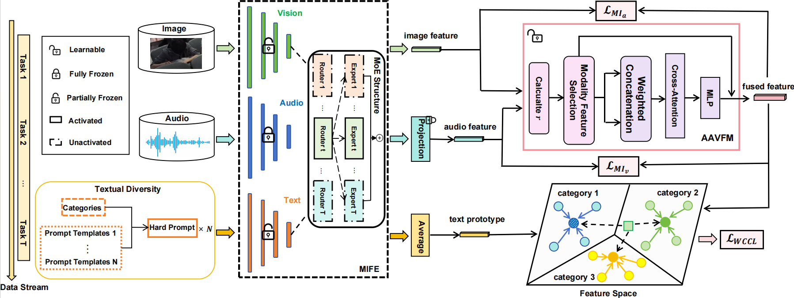

# Leveraging Pre-Trained Models for Multimodal Class-Incremental Learning under Adaptive Fusion
This repository is the implementation of the ICASSP 2025 paper "Leveraging Pre-Trained Models for Multimodal Class-Incremental Learning under Adaptive Fusion". MCIL-AudioCLIP effectively addresses the challenges of knowledge forgetting and cross-modal information integration faced by traditional classification models when dealing with continuously evolving and expanding new categories, by combining multimodal pre-trained models with incremental learning strategies in the context of continuous data streams.



## How to use

### Clone
```
git clone https://github.com/chenyukun924/MCIL-AudioCLIP.git
cd MCIL-AudioCLIP
```

### Environment
Firstly, you should make a new environment with python>=3.8, for example:
```
conda create -n mcil_audioclip python=3.9
```
Next, you can download pytorch from official site, for example:
```
pip install torch==2.1.0+cu118 torchvision==0.16.0+cu118 torchaudio==2.1.0+cu118 -f https://download.pytorch.org/whl/torch_stable.html
```
Lastly, run ```pip install -r requirements.txt```  in this repo to install a few more packages.

### Dataset Preparation 
miniARIC
https://ivipclab.github.io/publication_ARIC/ARIC/

We evaluate our model on three multimodal datasets: miniARIC, ImageNet-ESC-19, and ImageNet-ESC-27. You can download the miniARIC dataset from its homepage. The ImageNet-ESC-19 and ImageNet-ESC-27 datasets are constructed based on the ImageNet and ESC-50 datasets. For more details, you can refer to [DATASETS.md](https://github.com/linzhiqiu/cross_modal_adaptation/blob/main/DATASETS.md)
. The structure of our data folder is as follows:
```
data/
|-- classroom_data/
|   |-- audio/
|   |-- image/
|   |   |-- test/
|   |   |   |-- analyzing/
|   |   |   |-- ...
|   |   |   |-- yawning/
|   |   |-- train/
|   |   |   |-- analyzing/
|   |   |   |-- ...
|   |   |   |-- yawning/
|-- imagenet19/
|   |-- audio/
|   |   |-- test/
|   |   |   |-- n01514668/
|   |   |   |-- ...
|   |   |   |-- n04554684/
|   |   |-- train/
|   |   |   |-- n01514668/
|   |   |   |-- ...
|   |   |   |-- n04554684/
|   |-- image/
|   |   |-- test/
|   |   |   |-- n01514668/
|   |   |   |-- ...
|   |   |   |-- n04554684/
|   |   |-- train/
|   |   |   |-- n01514668/
|   |   |   |-- ...
|   |   |   |-- n04554684/
|-- imagenet27/
|   |-- audio/
|   |   |-- test/
|   |   |   |-- n01514668/
|   |   |   |-- ...
|   |   |   |-- n09421951/
|   |   |-- train/
|   |   |   |-- n01514668/
|   |   |   |-- ...
|   |   |   |-- n09421951/
|   |-- image/
|   |   |-- test/
|   |   |   |-- n01514668/
|   |   |   |-- ...
|   |   |   |-- n09421951/
|   |   |-- train/
|   |   |   |-- n01514668/
|   |   |   |-- ...
|   |   |   |-- n09421951/
```

### Running scripts
We provide the scripts for miniARIC, ImageNet-ESC-19 and ImageNet-ESC-27. Please run:

```
bash run.sh
```

The command to run the other two datasets is similar, in run.sh

### datasets
Cifar100 will download automatically.
Imagenet-R is randomly splited. You can also use our splited list in RAPF/imgr_split/imgr_train_test_split.txt.

The format of imgr_train_test_split.txt:
```
train
n02051845/art_0.jpg
...
test
n02051845/tattoo_4.jpg
...
```

## Acknowledgement
We thank the following repos providing helpful components/functions in our work.
- [MoE-Adapters4CL](https://github.com/JiazuoYu/MoE-Adapters4CL)
- [AudioCLIP](https://github.com/AndreyGuzhov/AudioCLIP)
- [cross_modal_adaptation](https://github.com/linzhiqiu/cross_modal_adaptation)


